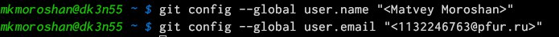
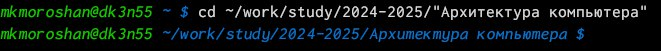

---
## Front matter
title: "Отчет по лабораторной работе №2"
subtitle: "Дисциплина: архитектура компьютера"
author: "Морошан Матвей Корнелиович"

## Generic otions
lang: ru-RU
toc-title: "Содержание"

## Bibliography
bibliography: bib/cite.bib
csl: pandoc/csl/gost-r-7-0-5-2008-numeric.csl

## Pdf output format
toc: true # Table of contents
toc-depth: 2
lof: true # List of figures
fontsize: 12pt
linestretch: 1.5
papersize: a4
documentclass: scrreprt
## I18n polyglossia
polyglossia-lang:
  name: russian
  options:
	- spelling=modern
	- babelshorthands=true
polyglossia-otherlangs:
  name: english
## I18n babel
babel-lang: russian
babel-otherlangs: english
## Fonts
mainfont: IBM Plex Serif
romanfont: IBM Plex Serif
sansfont: IBM Plex Sans
monofont: IBM Plex Mono
mainfontoptions: Ligatures=Common,Ligatures=TeX,Scale=0.94
romanfontoptions: Ligatures=Common,Ligatures=TeX,Scale=0.94
sansfontoptions: Ligatures=Common,Ligatures=TeX,Scale=MatchLowercase,Scale=0.94
monofontoptions: Scale=MatchLowercase,Scale=0.94,FakeStretch=0.9
## Biblatex
biblatex: true
biblio-style: "gost-numeric"
biblatexoptions:
  - parentracker=true
  - backend=biber
  - hyperref=auto
  - language=auto
  - autolang=other*
  - citestyle=gost-numeric
## Pandoc-crossref LaTeX customization
figureTitle: "Рис."
listingTitle: "Листинг"
lofTitle: "Список иллюстраций"
lolTitle: "Листинги"
## Misc options
indent: true
header-includes:
  - \usepackage{indentfirst}
  - \usepackage{float} # keep figures where there are in the text
  - \floatplacement{figure}{H} # keep figures where there are in the text
---

# Цель работы

Целью данной лабораторной работы является изучение идеологии и применения средств контроля версий, приобретение практических навыков по работе с системой git

# Задание

	1. Настройка GitHub
	
	2. Базовая настройка Git
	
	3. Создание SSH-ключа
	
	4. Создание рабочего пространства и репозитория курса на основе шаблона
	
	5. Создание репозитория курса на основе шаблона
	
	6. Настройка каталога курса
	
	7. Выполнение заданий для самостоятельной работы

# Выполнение лабораторной работы

## Настройка GitHub

Создаю учетную запись на GitHub (рис. [-@fig:001])

{#fig:001 width=70%}

## Базовая настройка git

Открываю терминал и делаю предварительную конфигурацию git, вводя следующие команды (рис. [-@fig:002])

{#fig:002 width=70%}

Настраиваю utf-8 в выводе сообщений git (рис. [-@fig:003])

{#fig:003 width=70%}

Задаю имя master для начальной ветки (рис. [-@fig:004])

{#fig:004 width=70%}

Задаю параметр autocrlf (рис. [-@fig:005])

{#fig:005 width=70%}

Задаю параметр safecrlf (рис. [-@fig:006])

{#fig:006 width=70%}

## Создание SSH-ключа

Сгенерирую пару ключей (приватный и открытый). Ввожу команду ssh-keygen -C "Имя Фамилия <workmail>" (рис. [-@fig:007])

{#fig:007 width=70%}

Копирую открытый ключ с помощью утилиты xclip (рис. [-@fig:008])

{#fig:008 width=70%}

Захожу на GitHub. Перехожу в Settings, SSH and GPG keys и нажимаю кнопку New SSH key. Вставляю скопированный ключ и указываю имя в поле Title. Нажимаю Add SSH-key (рис. [-@fig:009])

{#fig:009 width=70%}

## Создание рабочего пространства и репозитория курса на основе шаблона

Открываю терминал. Создаю рабочее пространство с помощью mkdir, ключа -p. Проверяю благодаря команде ls правильность создания каталогов (рис. [-@fig:010])

{#fig:010 width=70%}

## Создание репозитория курса на основе шаблона

Перехожу на страницу репозитория с шаблоном курса https://github.com/yamadharma/course-directory-student-template. Выбираю Use this template (рис. [-@fig:011])

{#fig:011 width=70%}

В открывшемся окне задаю имя репозитория (Repository name): study_2024-2025_arh-pc и создаю репозиторий. Нажимаю на кнопку Create repository (рис. [-@fig:012])

{#fig:012 width=70%}

Захожу в терминал. С помощью команды cd перехожу в каталог курса (рис. [-@fig:013])

{#fig:013 width=70%}

Клонирую созданный репозиторий следующей командой (рис. [-@fig:014])

{#fig:014 width=70%}

Копирую ссылку на клонирование на странице репозитория, переходя во вкладку Code и выбрав вкладку SSH (рис. [-@fig:015])

{#fig:015 width=70%}

## Настройка каталога курса

Перехожу в каталог курса с помощью команды cd (рис. [-@fig:016])

{#fig:016 width=70%}

Удаляю лишние файлы (рис. [-@fig:017])

{#fig:017 width=70%}

Создаю необходимые каталоги (рис. [-@fig:018])

{#fig:018 width=70%}

Отправляю созданные каталоги на сервер. Добавляю с помощью команды git add . , сохраняю изменения с помощью команды git commit (рис. [-@fig:019])

{#fig:019 width=70%}

Выгружаю изменения на сервер с помощью команды git push (рис. [-@fig:020])

{#fig:020 width=70%}

Проверяю правильность выполнения на GitHub (рис. [-@fig:021])

{#fig:021 width=70%}

## Выполнение заданий для самостоятельной работы

Перехожу в labs/lab02/report с помощью команды cd. Создаю там файл для отчета по второй лабораторной работе с помощью команды touch (рис. [-@fig:022])

{#fig:022 width=70%}

Перехожу в подкаталог lab01/report с помощью cd (рис. [-@fig:023])

{#fig:023 width=70%}

Проверяю местонахождение файла с отчетом по первой лабораторной работе с помощью команды ls (рис. [-@fig:024])

{#fig:024 width=70%}

Копирую первую лабораторную работу с помощью cp (рис. [-@fig:025])

{#fig:025 width=70%}

С помощью команды ls проверяю правильность выполнения (рис. [-@fig:026])

{#fig:026 width=70%}

С помощью команды git add добавляю в коммит отчет по первой лабораторной работе (рис. [-@fig:027])

{#fig:027 width=70%}

Перехожу в lab02/report и так же добавляю файл для отчета по второй лабораторной работе. Сохраняю изменения с помощью git commit (рис. [-@fig:028])

{#fig:028 width=70%}

Отправляю в центральный репозиторий изменения командой git push -f origin master (рис. [-@fig:029])

{#fig:029 width=70%}

Проверяю правильность выполнения на GitHub (рис. [-@fig:030])

{#fig:030 width=70%}

Проверяю, что файлы появились в lab01/report (рис. [-@fig:031])

{#fig:031 width=70%}

Аналогично для lab02/report (рис. [-@fig:032])

{#fig:032 width=70%}

# Выводы

При выполнении данной лабораторной работы я изучил идеологию и применение средств контроля версий и приобрел практические навыки по работе с системой git
