---
## Front matter
title: "Отчет по лабораторной работе №3"
subtitle: "Дисциплина: Архитектура компьютера"
author: "Морошан Матвей Корнелиович"

## Generic otions
lang: ru-RU
toc-title: "Содержание"

## Bibliography
bibliography: bib/cite.bib
csl: pandoc/csl/gost-r-7-0-5-2008-numeric.csl

## Pdf output format
toc: true # Table of contents
toc-depth: 2
lof: true # List of figures
fontsize: 12pt
linestretch: 1.5
papersize: a4
documentclass: scrreprt
## I18n polyglossia
polyglossia-lang:
  name: russian
  options:
	- spelling=modern
	- babelshorthands=true
polyglossia-otherlangs:
  name: english
## I18n babel
babel-lang: russian
babel-otherlangs: english
## Fonts
mainfont: IBM Plex Serif
romanfont: IBM Plex Serif
sansfont: IBM Plex Sans
monofont: IBM Plex Mono
mainfontoptions: Ligatures=Common,Ligatures=TeX,Scale=0.94
romanfontoptions: Ligatures=Common,Ligatures=TeX,Scale=0.94
sansfontoptions: Ligatures=Common,Ligatures=TeX,Scale=MatchLowercase,Scale=0.94
monofontoptions: Scale=MatchLowercase,Scale=0.94,FakeStretch=0.9
## Biblatex
biblatex: true
biblio-style: "gost-numeric"
biblatexoptions:
  - parentracker=true
  - backend=biber
  - hyperref=auto
  - language=auto
  - autolang=other*
  - citestyle=gost-numeric
## Pandoc-crossref LaTeX customization
figureTitle: "Рис."
listingTitle: "Листинг"
lofTitle: "Список иллюстраций"
lolTitle: "Листинги"
## Misc options
indent: true
header-includes:
  - \usepackage{indentfirst}
  - \usepackage{float} # keep figures where there are in the text
  - \floatplacement{figure}{H} # keep figures where there are in the text
---

# Цель работы

Целью данной лабораторной работы является освоение процедуры оформления отчетов с помощью легковесного языка разметки Markdown

# Задание

	1. Выполнение отчета по лабораторной работе №3
	
	2. Выполнение заданий для самостоятельной работы

# Выполнение лабораторной работы

## Выполнение отчета по лабораторной работе №3

Открываю терминал. Перехожу в каталог курса, сформированный при выполнении лабораторной работы №2. Обновляю локальный репозиторий командой git pull (рис. [-@fig:001])

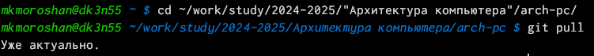{#fig:001 width=70%}

Перехожу в каталог с шаблоном отчета по лабораторной работе №3 (рис. [-@fig:002])

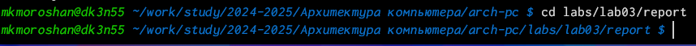{#fig:002 width=70%}

Провожу компиляцию шаблона с использованием Makefile, вводя команду make. Проверяю наличие созданных файлов (рис. [-@fig:003])

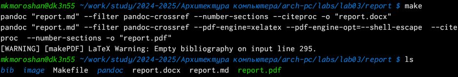{#fig:003 width=70%}

Открываю и проверяю файл report.pdf (рис. [-@fig:004])

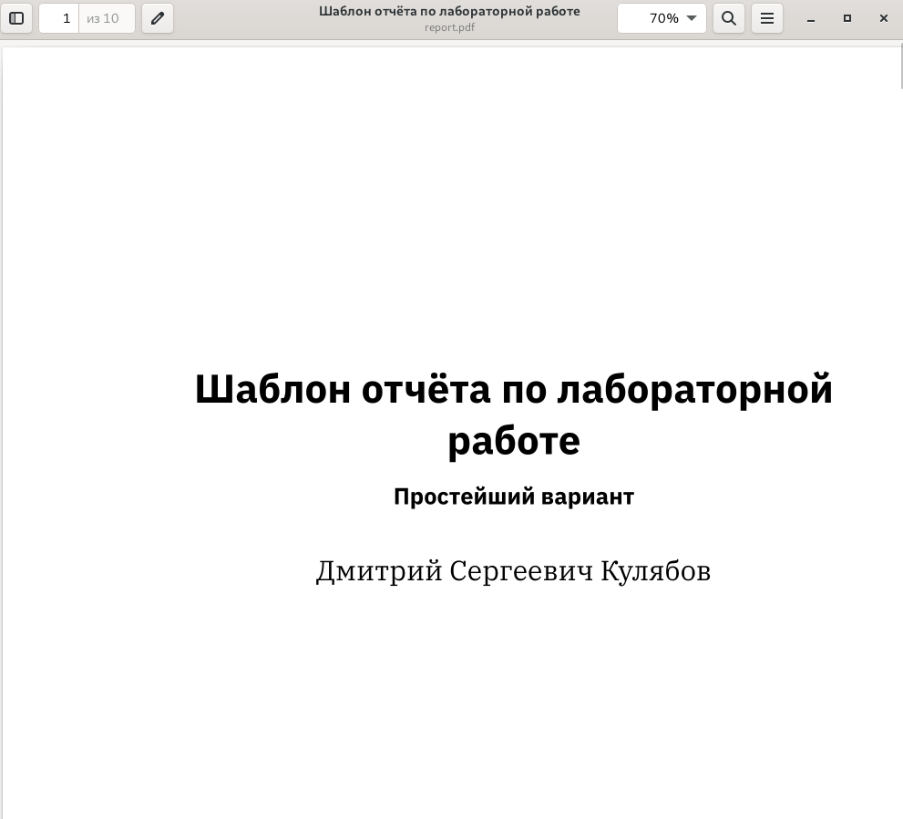{#fig:004 width=70%}

Открываю и проверяю файл report.docx (рис. [-@fig:005])

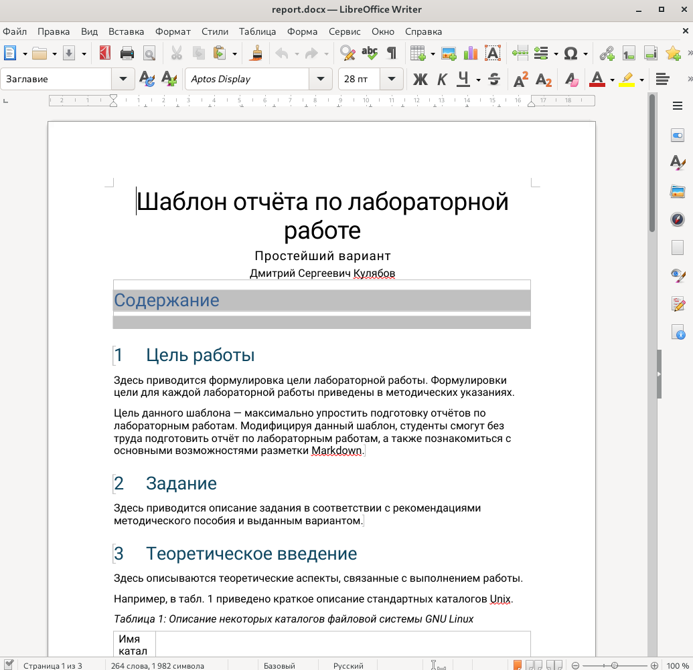{#fig:005 width=70%}

Удаляю полученные файлы с использованием Makefile, вводя команду make clean и проверяю командой ls (рис. [-@fig:006])

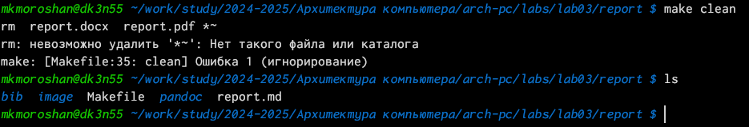{#fig:006 width=70%}

Копирую report.md с названием Л03_Морошан_отчет.md и открываю с помощью gedit (рис. [-@fig:007])

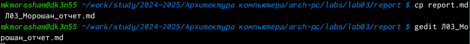{#fig:007 width=70%}

При открытие файла вижу данный шаблон (рис. [-@fig:008])

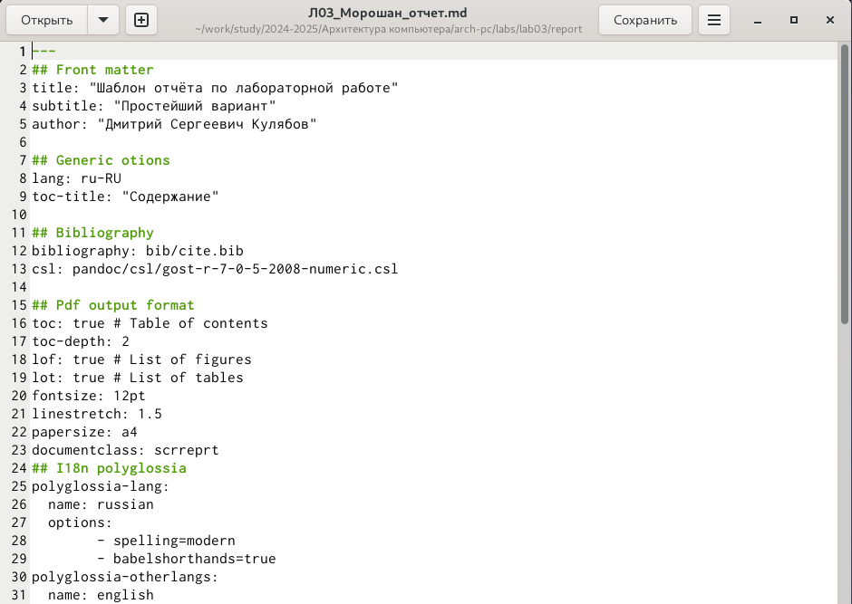{#fig:008 width=70%}

Начинаю написание отчета по лабораторной работе №3 (рис. [-@fig:009])

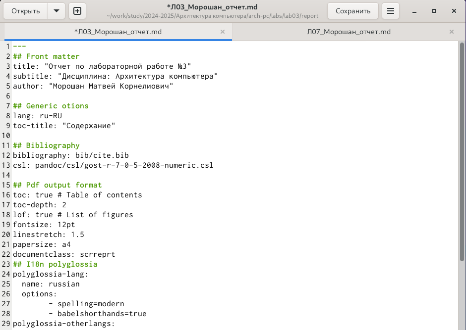{#fig:009 width=70%}

Компилирую файл с отчетом и загружаю отчет на GitHub

## Выполнение заданий для самостоятельной работы

Перехожу в соответствующий каталог второй лабораторной работы (рис. [-@fig:010])

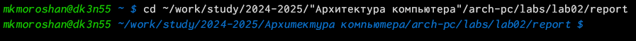{#fig:010 width=70%}

Копирую report.md с названием Л02_Морошан_отчет.md (рис. [-@fig:011])

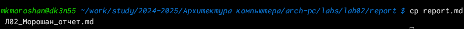{#fig:011 width=70%}

Открываю данный файл с помощью gedit (рис. [-@fig:012])

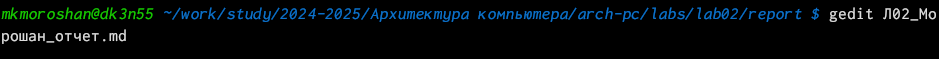{#fig:012 width=70%}

Начинаю работу над отчетом по лабораторной работе №2 (рис. [-@fig:013])

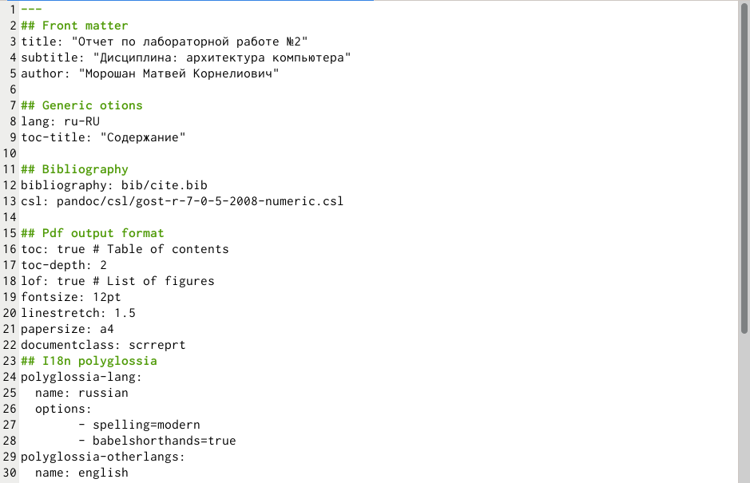{#fig:013 width=70%}

Компилирую командой make (рис. [-@fig:014])

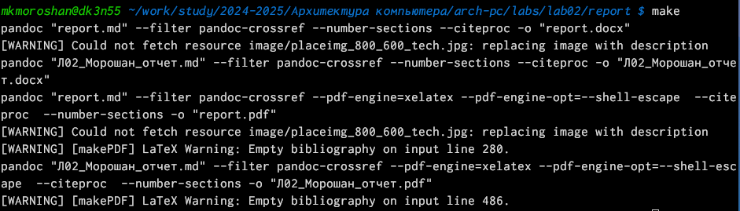{#fig:014 width=70%}

Проверяю все файлы командой ls (рис. [-@fig:015])

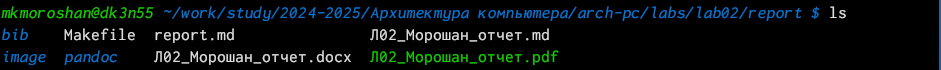{#fig:015 width=70%}

Добавляю файлы на GitHub (рис. [-@fig:016])

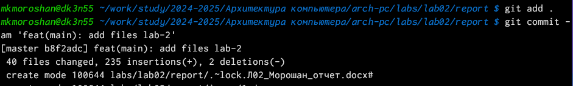{#fig:016 width=70%}

Отправляю файлы на сервер командой git push (рис. [-@fig:017])

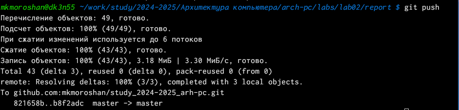{#fig:017 width=70%}

# Выводы

При выполнении данной лабораторной работы я освоил процедуры оформления отчетов с помощью легковесного языка разметки Markdown
