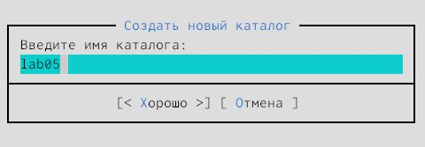
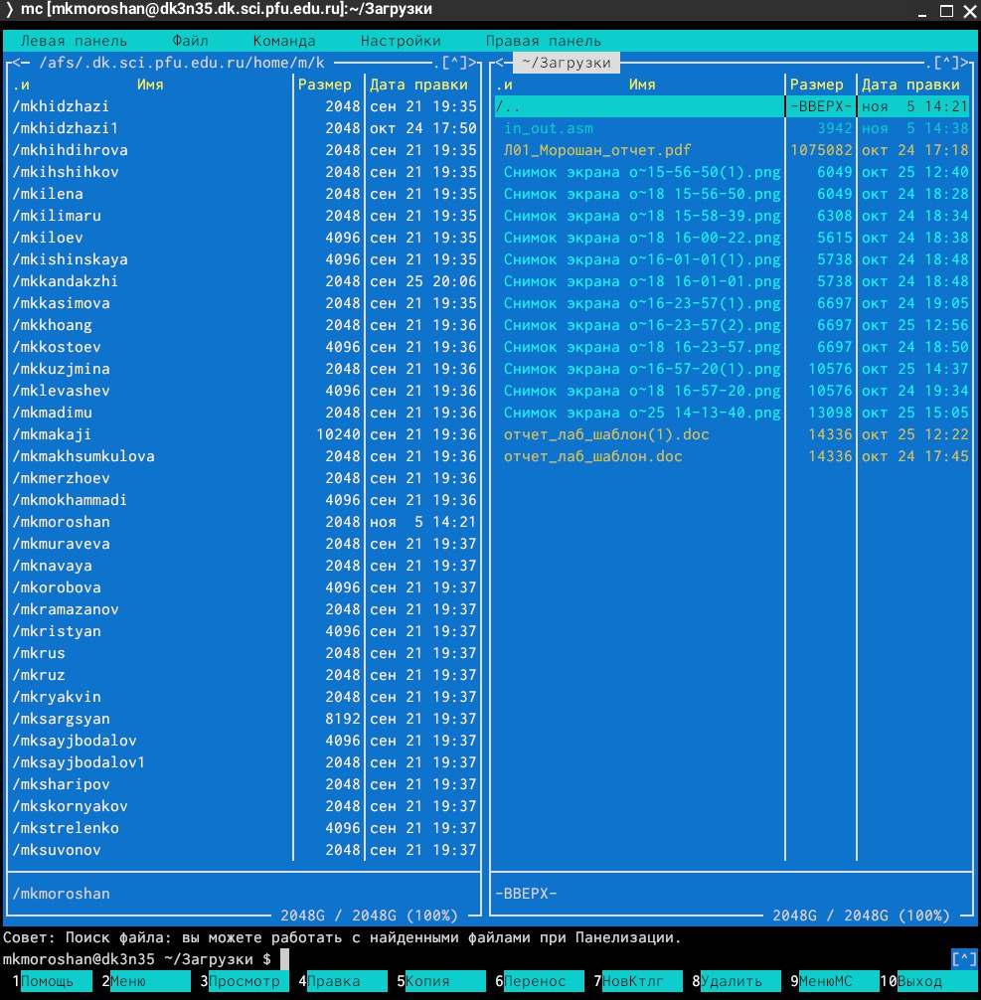
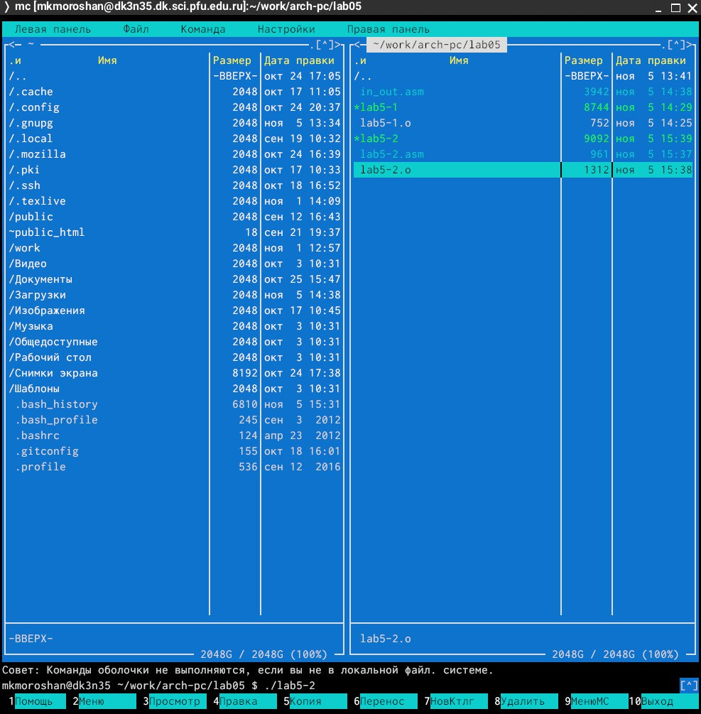

---
## Front matter
title: "Отчёт по лабораторной работе №5"
subtitle: "Дисциплина: архитектура компьютера"
author: "Морошан Матвей Корнелиович"

## Generic otions
lang: ru-RU
toc-title: "Содержание"

## Bibliography
bibliography: bib/cite.bib
csl: pandoc/csl/gost-r-7-0-5-2008-numeric.csl

## Pdf output format
toc: true # Table of contents
toc-depth: 2
lof: true # List of figures
fontsize: 12pt
linestretch: 1.5
papersize: a4
documentclass: scrreprt
## I18n polyglossia
polyglossia-lang:
  name: russian
  options:
	- spelling=modern
	- babelshorthands=true
polyglossia-otherlangs:
  name: english
## I18n babel
babel-lang: russian
babel-otherlangs: english
## Fonts
mainfont: PT Serif
romanfont: PT Serif
sansfont: PT Sans
monofont: PT Mono
mainfontoptions: Ligatures=TeX
romanfontoptions: Ligatures=TeX
sansfontoptions: Ligatures=TeX,Scale=MatchLowercase
monofontoptions: Scale=MatchLowercase,Scale=0.9
## Biblatex
biblatex: true
biblio-style: "gost-numeric"
biblatexoptions:
  - parentracker=true
  - backend=biber
  - hyperref=auto
  - language=auto
  - autolang=other*
  - citestyle=gost-numeric
## Pandoc-crossref LaTeX customization
figureTitle: "Рис."
listingTitle: "Листинг"
lofTitle: "Список иллюстраций"
lolTitle: "Листинги"
## Misc options
indent: true
header-includes:
  - \usepackage{indentfirst}
  
  - \usepackage{float} # keep figures where there are in the text
  
  - \floatplacement{figure}{H} # keep figures where there are in the text
---

# Цель работы

Целью данной лабораторной работы является приобретение практических навыков работы в Midnight Commander и освоение инструкций языка ассемблера mov и int.

# Задание

	1. Основы работы с Midnight Commander
	
	2. Структура программы на языке ассемблера NASM
	
	3. Подключение внешнего файла
	
	4. Выполнение заданий для самостоятельной работы

# Выполнение лабораторной работы

## Основы работы с Midnight Commander

Открываю Midnight Commander, введя команду mc (рис. [-@fig:001])

{#fig:001 width=70%}

Перехожу в каталог ~/work/arch-pc (рис. [-@fig:002])

{#fig:002 width=70%}

Создаю каталог lab05 (рис. [-@fig:003])

{#fig:003 width=70%}

Проверяю создание каталога (рис. [-@fig:004])

{#fig:004 width=70%}

Перехожу в каталог ~/work/arch-pc/lab05 (рис. [-@fig:005])

{#fig:005 width=70%}

Создаю файл в котором буду работать с помощью команды touch lab5-1.asm (рис. [-@fig:006])

{#fig:006 width=70%}

Проверяю создался ли нужный файл (рис. [-@fig:007])

{#fig:007 width=70%}

## Структура программы на языке ассемблера NASM

С помощью F4 открываю созданный файл для редактирования (рис. [-@fig:008])

{#fig:008 width=70%}

Ввожу в файл текст программы из листинга 5.1, сохраняю и закрываю (рис. [-@fig:009])

{#fig:009 width=70%}

С помощью F3 открываю файл для просмотра и убеждаюсь, что файл содержит текст программы (рис. [-@fig:010])

{#fig:010 width=70%}

Оттранслировав текст в объектный файл командой nasm -f elf lab5-1.asm, выполняю компоновку объектного файла с помощью команды ld -m elf_i386 -o lab5-1 lab5-1.o (рис. [-@fig:011])

{#fig:011 width=70%}

Вижу результат предыдущих команд (рис. [-@fig:012])

{#fig:012 width=70%}

Запускаю исполняемый файл командой ./lab5-1 (рис. [-@fig:013])

{#fig:013 width=70%}

Ввожу свои ФИО и программа заканчивает работу (рис. [-@fig:014])

{#fig:014 width=70%}

## Подключение внешнего файла

Скачиваю файл in_out.asm и он попадает в папку загрузки (рис. [-@fig:015])

{#fig:015 width=70%}

Копирую in_out.asm в каталог lab05 (рис. [-@fig:016])

{#fig:016 width=70%}

Проверяю находится ли этот файл в каталоге lab05 (рис. [-@fig:017])

{#fig:017 width=70%}

Копирую файл lab5-1 с помощью F5 с другим именем (рис. [-@fig:018])

{#fig:018 width=70%}

Проверяю копирование файла (рис. [-@fig:019])

{#fig:019 width=70%}

Открываю файл с помощью F4 и изменяю текст (рис. [-@fig:020])

{#fig:020 width=70%}

Оттранслировав текст в объектный файл командой nasm -f elf lab5-2.asm, выполняю компоновку объектного файла с помощью команды ld -m elf_i386 -o lab5-2 lab5-2.o (рис. [-@fig:021]

{#fig:021 width=70%}

С помощью команды ./lab5-2 запускаю файл (рис. [-@fig:022])

{#fig:022 width=70%}

Ввожу свои ФИО в строку (рис. [-@fig:023])

{#fig:023 width=70%}

Захожу в файл с помощью F4 и заменяю sprintLF на sprint, сохраняю и закрываю (рис. [-@fig:024])

{#fig:024 width=70%}

Снова транслирую файл с помощью nasm (рис. [-@fig:025])

{#fig:025 width=70%}

Выполняю компоновку объектного файла (рис. [-@fig:026])

{#fig:026 width=70%}

Запускаю новый исполняемый файл (рис. [-@fig:027])

{#fig:027 width=70%}

Снова ввожу свои ФИО (рис. [-@fig:028])

{#fig:028 width=70%}

Разница между файлами в том, что первый файл просит ввод с новой строки, а второй файл без переноса на новую строку

## Выполнение заданий для самостоятельной работы

Создаю копию файла lab5-1.asm с помощью F5 и называю его lab5-1-1.asm (рис. [-@fig:029])

{#fig:029 width=70%}

Открываю его с помощью F4 и изменяю текст файла (рис. [-@fig:030])

{#fig:030 width=70%}

Транслирую файл lab5-1-1.asm (рис. [-@fig:031])

{#fig:031 width=70%}

Выполняю компоновку файла lab5-1-1.asm (рис. [-@fig:032])

{#fig:032 width=70%}

Запускаю данный файл (рис. [-@fig:033])

{#fig:033 width=70%}

Вновь ввожу ФИО (рис. [-@fig:034])

{#fig:034 width=70%}

Создаю копию файла lab5-2.asm с помощью F5 и называю его lab5-2-1.asm (рис. [-@fig:035])

{#fig:035 width=70%}

Открываю файл и изменяю текст (рис. [-@fig:036])

{#fig:036 width=70%}

Транслирую файл lab5-2-1.asm (рис. [-@fig:037])

{#fig:037 width=70%}

Выполнение компоновку файла lab5-2-1.asm (рис. [-@fig:038])

{#fig:038 width=70%}

Запускаю lab5-2-1.asm (рис. [-@fig:039])

{#fig:039 width=70%}

Без переноса строки записываю свои ФИО (рис. [-@fig:040])

{#fig:040 width=70%}

# Выводы

При выполнении данной лабораторной работы я приобрел практические навыки работы в Midnight Commander, освоил инструкции языка ассемблера mov и int.
