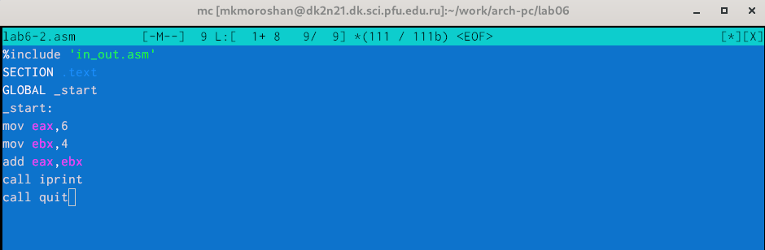
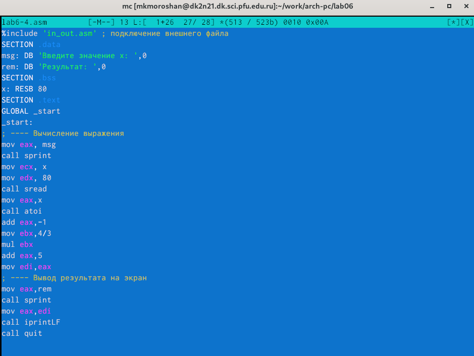

---
## Front matter
title: "Отчет по лабораторной работе №6"
subtitle: "Дисциплина: архитектура компьютера"
author: "Морошан Матвей Корнелиович"

## Generic otions
lang: ru-RU
toc-title: "Содержание"

## Bibliography
bibliography: bib/cite.bib
csl: pandoc/csl/gost-r-7-0-5-2008-numeric.csl

## Pdf output format
toc: true # Table of contents
toc-depth: 2
lof: true # List of figures
fontsize: 12pt
linestretch: 1.5
papersize: a4
documentclass: scrreprt
## I18n polyglossia
polyglossia-lang:
  name: russian
  options:
	- spelling=modern
	- babelshorthands=true
polyglossia-otherlangs:
  name: english
## I18n babel
babel-lang: russian
babel-otherlangs: english
## Fonts
mainfont: IBM Plex Serif
romanfont: IBM Plex Serif
sansfont: IBM Plex Sans
monofont: IBM Plex Mono
mainfontoptions: Ligatures=Common,Ligatures=TeX,Scale=0.94
romanfontoptions: Ligatures=Common,Ligatures=TeX,Scale=0.94
sansfontoptions: Ligatures=Common,Ligatures=TeX,Scale=MatchLowercase,Scale=0.94
monofontoptions: Scale=MatchLowercase,Scale=0.94,FakeStretch=0.9
## Biblatex
biblatex: true
biblio-style: "gost-numeric"
biblatexoptions:
  - parentracker=true
  - backend=biber
  - hyperref=auto
  - language=auto
  - autolang=other*
  - citestyle=gost-numeric
## Pandoc-crossref LaTeX customization
figureTitle: "Рис."
listingTitle: "Листинг"
lofTitle: "Список иллюстраций"
lolTitle: "Листинги"
## Misc options
indent: true
header-includes:
  - \usepackage{indentfirst}
  - \usepackage{float} # keep figures where there are in the text
  - \floatplacement{figure}{H} # keep figures where there are in the text
---

# Цель работы

Целью данной лабораторной работы является освоение арифметических инструкций языка ассемблера NASM

# Задание

	1. Символьные и численные данные в NASM
	
	2. Выполнение арифметических операций в NASM
	
	3. Выполнение заданий для самостоятельной работы

# Выполнение лабораторной работы

## Символьные и численные данные в NASM

Создаю каталог для программ лабораторной работы №6, перехожу в него и создаю файл lab6-1.asm (рис. [-@fig:001])

{#fig:001 width=70%}

Копирую файл in_out.asm в каталог для лабораторной работы №6 для дальнейшей работы (рис. [-@fig:002])

{#fig:002 width=70%}

Открываю файл lab6-1.asm и ввожу текст программы из листинга 6.1 (рис. [-@fig:003])

{#fig:003 width=70%}

Создаю исполняемый файл и запускаю его (рис. [-@fig:004])

{#fig:004 width=70%}

Изменяю текст программы (рис. [-@fig:005])

{#fig:005 width=70%}

Снова создаю исполняемый файл и запускаю его. Символ не отображается на экране (рис. [-@fig:006])

{#fig:006 width=70%}

Создаю файл lab6-2.asm (рис. [-@fig:007])

{#fig:007 width=70%}

Ввожу в него текст программы из листинга 6.2 (рис. [-@fig:008])

{#fig:008 width=70%}

Создаю исполняемый файл и запускаю его (рис. [-@fig:009])

{#fig:009 width=70%}

Изменяю текст программы (рис. [-@fig:010])

{#fig:010 width=70%}

Создаю исполняемый файл и запускаю его (рис. [-@fig:011])

{#fig:011 width=70%}

Изменяю iprintLF на iprint  (рис. [-@fig:012])

{#fig:012 width=70%}

Вновь создаю исполняемый файл и запускаю его. iprint не добавляет переноса строки в отличие от iprintLF (рис. [-@fig:013])

{#fig:013 width=70%}

## Выполнение арифметических операций в NASM

Создаю файл lab6-3.asm (рис. [-@fig:014])

{#fig:014 width=70%}

Ввожу текст програмы из листинга 6.3 и ввожу в lab6-3.asm (рис. [-@fig:015])

{#fig:015 width=70%}

Создаю исполняемый файл и запускаю его (рис. [-@fig:016])

{#fig:016 width=70%}

Изменяю текст программы для вычисления выражения f(x)=(4*6+2)/5 (рис. [-@fig:017])

{#fig:017 width=70%}

Создаю исполняемый файл и запускаю его (рис. [-@fig:018])

{#fig:018 width=70%}

Создаю файл variant.asm (рис. [-@fig:019])

{#fig:019 width=70%}

Ввожу текст программы из листинга 6.4 в файл variant.asm (рис. [-@fig:020])

{#fig:020 width=70%}

Создаю исполняемый файл и запускаю его (рис. [-@fig:021])

{#fig:021 width=70%}

### Ответы на вопросы

	1. За вывод на экран сообщения 'Ваш вариант:' отвечают строки листинга:

	mov eax,rem
	call sprint

	2. Инструкция mov ecx, x используется, чтобы вложить адрес вводимой строки x в регистр ecx

	Инструкция mov edx, 80 - это запись в регистр edx длины вводимой строки

	Инструкция call sread - вызов подпрограммы из внешнего файла, обеспечивающей
	ввод сообщения с клавиатуры

	3. Инструкция call atoi используется для вызова подпрограммы из внешнего файла, которая 
	преобразует ascii-код символа в целое число и записывает результат в регистр eax
	
	4. За вычисление варианта отвечают строки:
	
	xor edx,edx
	mov ebx,20
	div ebx
	inc edx
	
	5. Остаток от деления при выполнении иструкции div ebx записывается в регистр edx
	
	6. Инструкция inc edx увеличивает значение регистра edx на 1
	
	7. За вывод на экран результата вычислений отвечают следующие строки:
	
	mov eax,edx
	call iprintLF
	
## Выполнение заданий для самостоятельной работы

Создаю файл для выполнения в нем заданий для самостоятельной работы (рис. [-@fig:022])

{#fig:022 width=70%}

Вписываю текст программы в файл для f(x)=4/3(x-1)+5 (рис. [-@fig:023])

{#fig:023 width=70%}

Создаю файл и запускаю его. Ввожу значения x=4 и x=10 и получаю результат (рис. [-@fig:024])

{#fig:024 width=70%}

# Выводы

При выполнении данной лабораторной работы я освоил арифметические инструкции языка ассемблера NASM
