---
## Front matter
title: "Отчет по лабораторной работе №7"
subtitle: "Дисциплина: архитектура компьютера"
author: "Морошан Матвей Корнелиович"

## Generic otions
lang: ru-RU
toc-title: "Содержание"

## Bibliography
bibliography: bib/cite.bib
csl: pandoc/csl/gost-r-7-0-5-2008-numeric.csl

## Pdf output format
toc: true # Table of contents
toc-depth: 2
lof: true # List of figures
fontsize: 12pt
linestretch: 1.5
papersize: a4
documentclass: scrreprt
## I18n polyglossia
polyglossia-lang:
  name: russian
  options:
	- spelling=modern
	- babelshorthands=true
polyglossia-otherlangs:
  name: english
## I18n babel
babel-lang: russian
babel-otherlangs: english
## Fonts
mainfont: IBM Plex Serif
romanfont: IBM Plex Serif
sansfont: IBM Plex Sans
monofont: IBM Plex Mono
mainfontoptions: Ligatures=Common,Ligatures=TeX,Scale=0.94
romanfontoptions: Ligatures=Common,Ligatures=TeX,Scale=0.94
sansfontoptions: Ligatures=Common,Ligatures=TeX,Scale=MatchLowercase,Scale=0.94
monofontoptions: Scale=MatchLowercase,Scale=0.94,FakeStretch=0.9
## Biblatex
biblatex: true
biblio-style: "gost-numeric"
biblatexoptions:
  - parentracker=true
  - backend=biber
  - hyperref=auto
  - language=auto
  - autolang=other*
  - citestyle=gost-numeric
## Pandoc-crossref LaTeX customization
figureTitle: "Рис."
listingTitle: "Листинг"
lofTitle: "Список иллюстраций"
lolTitle: "Листинги"
## Misc options
indent: true
header-includes:
  - \usepackage{indentfirst}
  - \usepackage{float} # keep figures where there are in the text
  - \floatplacement{figure}{H} # keep figures where there are in the text
---

# Цель работы

Целью данной лабораторной работы является изучение команд условного и безусловного переходов, приобретение навыков написания программ с использованием переходов, знакомство с назначением и структурой файла листинга

# Задание

	1. Реализация переходов в NASM
	
	2. Изучение структуры файла листинга
	
	3. Выполнение заданий для самостоятельной работы
	
# Выполнение лабораторной работы

## Реализация переходов в NASM

Создаю каталог для программ лабораторной работы №7, перехожу в него и создаю файл lab7-1.asm (рис. [-@fig:001])

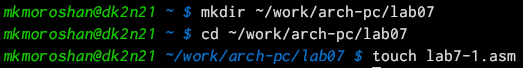{#fig:001 width=70%}

Копирую файл in_out.asm из загрузок в соответствующую папку для дальнейшей работы (рис. [-@fig:002])

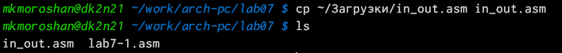{#fig:002 width=70%}

Ввожу в lab7-1.asm текст программы из листинга 7.1 (рис. [-@fig:003])

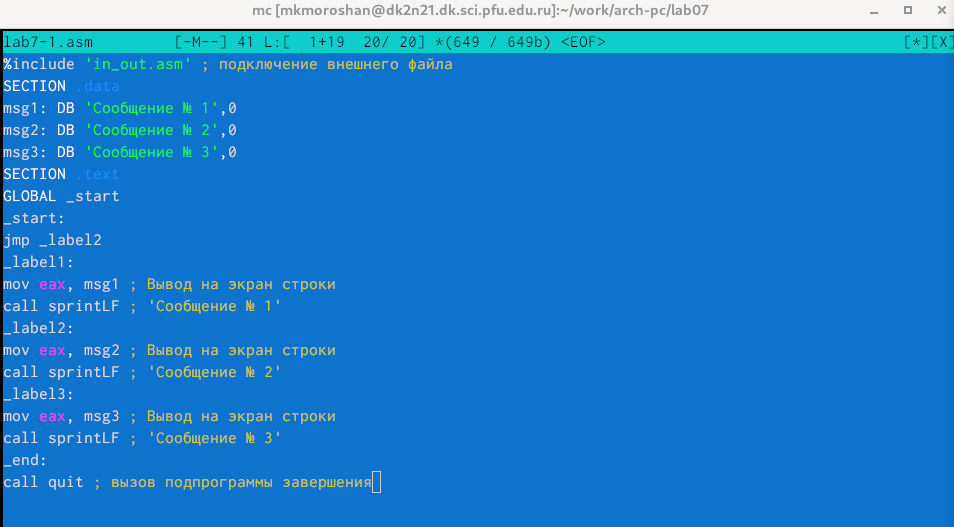{#fig:003 width=70%}

Создаю исполняемый файл и запускаю его (рис. [-@fig:004])

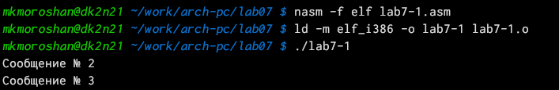{#fig:004 width=70%}

Ввожу текст программы листинга 7.2 (рис. [-@fig:005])

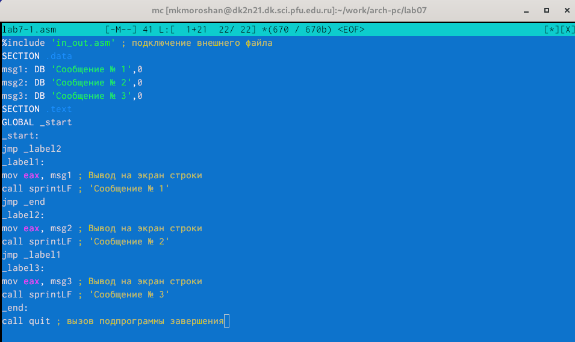{#fig:005 width=70%}

Создаю исполняемый файл и запускаю его (рис. [-@fig:006])

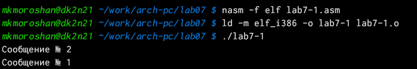{#fig:006 width=70%}

Изменяю текст программы так, чтоб вывод был в нужной последовательности (рис. [-@fig:007])

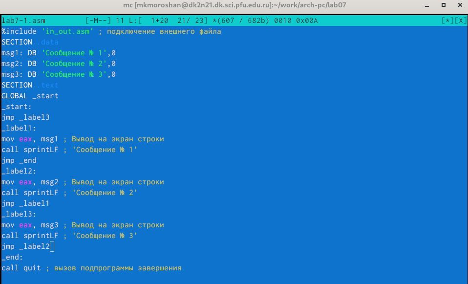{#fig:007 width=70%}

Создаю исполняемый файл и запускаю его (рис. [-@fig:008])

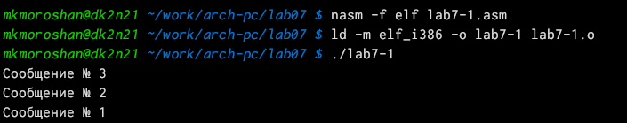{#fig:008 width=70%}

Создаю файл lab7-2.asm (рис. [-@fig:009])

{#fig:009 width=70%}

Ввожу текст программы из листинга 7.3 в файл (рис. [-@fig:010])

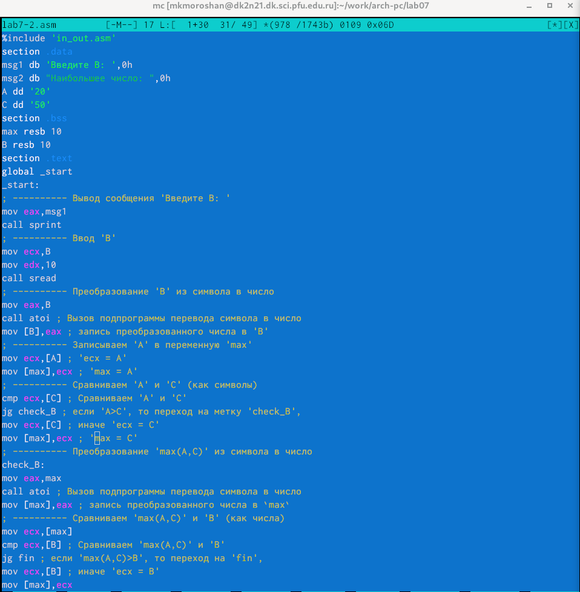{#fig:010 width=70%}

Создаю исполняемый файл и проверяю его работу для разных значений B (рис. [-@fig:011])

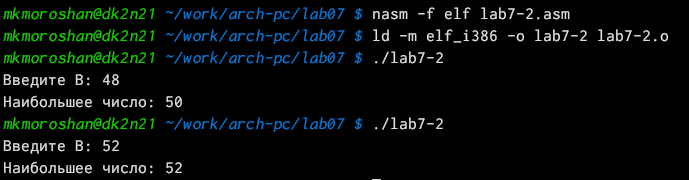{#fig:011 width=70%}

## Изучение структуры файла листинга

Создаю файл листинга для программы из файла lab7-2.asm и открываю его (рис. [-@fig:012])

{#fig:012 width=70%}

Объяснение строки: В регистр eax мы вносим значение 4 (рис. [-@fig:013])

{#fig:013 width=70%}

Объяснение строки: В регистр eax мы вносим значение 3 (рис. [-@fig:014])

{#fig:014 width=70%}

Объяснение строки: Вызов подпрограммы перевода символа в число (рис. [-@fig:015])

{#fig:015 width=70%}

Удаляю один из операндов (рис. [-@fig:016])

{#fig:016 width=70%}

Выполняю трансляцию с получением файла листинга, но ничего не выводит (рис. [-@fig:017])

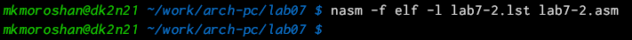{#fig:017 width=70%}

После трансляции захожу обратно и вижу, что операнд вернулся на место (рис. [-@fig:018])

{#fig:018 width=70%}

## Выполнение заданий для самостоятельной работы

Создаю файл для задания №1 (рис. [-@fig:019])

{#fig:019 width=70%}

Записываю текст программы для нахождения наименьшего числа (рис. [-@fig:020])

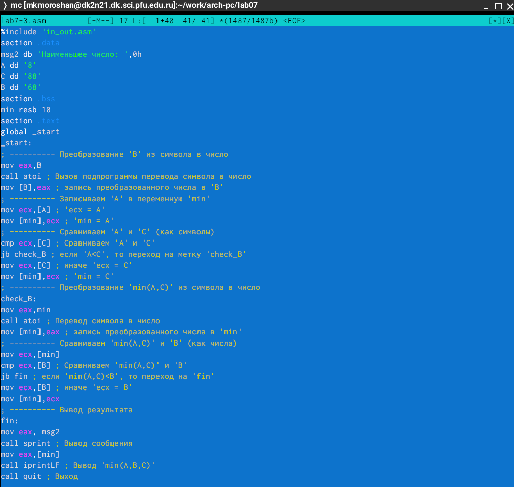{#fig:020 width=70%}

Создаю исполняемый файл и проверяю правильность работы (рис. [-@fig:021])

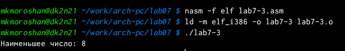{#fig:021 width=70%}

Создаю файл для задания №2 (рис. [-@fig:022])

{#fig:022 width=70%}

Записываю текст программы для вычисления выражения f(x) (рис. [-@fig:023])

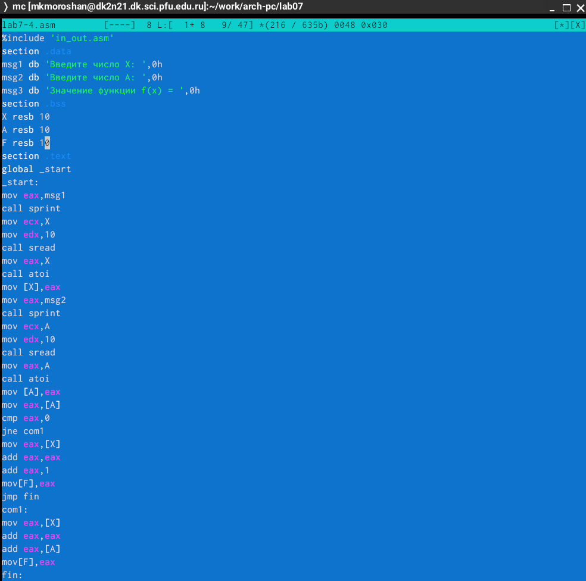{#fig:023 width=70%}

Создаю исполняемый файл, запускаю и убеждаюсь в правильности программы (рис. [-@fig:024])

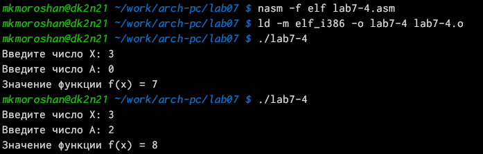{#fig:024 width=70%}

# Выводы

При выполнении данной лабораторной работы я изучил команды условного и безусловного переходов, приобрёл навыки написания программ с использованием переходов, познакомился с назначением и структурой файла листинга
