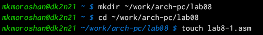
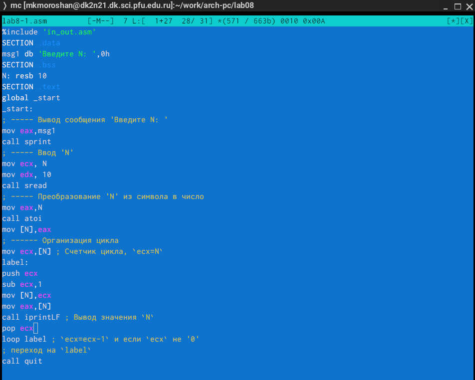
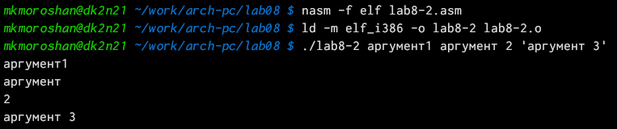

---
## Front matter
title: "Отчет по лабораторной работе №8"
subtitle: "Дисциплина: Архитектура компьютера"
author: "Морошан Матвей Корнелиович"

## Generic otions
lang: ru-RU
toc-title: "Содержание"

## Bibliography
bibliography: bib/cite.bib
csl: pandoc/csl/gost-r-7-0-5-2008-numeric.csl

## Pdf output format
toc: true # Table of contents
toc-depth: 2
lof: true # List of figures
fontsize: 12pt
linestretch: 1.5
papersize: a4
documentclass: scrreprt
## I18n polyglossia
polyglossia-lang:
  name: russian
  options:
	- spelling=modern
	- babelshorthands=true
polyglossia-otherlangs:
  name: english
## I18n babel
babel-lang: russian
babel-otherlangs: english
## Fonts
mainfont: IBM Plex Serif
romanfont: IBM Plex Serif
sansfont: IBM Plex Sans
monofont: IBM Plex Mono
mainfontoptions: Ligatures=Common,Ligatures=TeX,Scale=0.94
romanfontoptions: Ligatures=Common,Ligatures=TeX,Scale=0.94
sansfontoptions: Ligatures=Common,Ligatures=TeX,Scale=MatchLowercase,Scale=0.94
monofontoptions: Scale=MatchLowercase,Scale=0.94,FakeStretch=0.9
## Biblatex
biblatex: true
biblio-style: "gost-numeric"
biblatexoptions:
  - parentracker=true
  - backend=biber
  - hyperref=auto
  - language=auto
  - autolang=other*
  - citestyle=gost-numeric
## Pandoc-crossref LaTeX customization
figureTitle: "Рис."
listingTitle: "Листинг"
lofTitle: "Список иллюстраций"
lolTitle: "Листинги"
## Misc options
indent: true
header-includes:
  - \usepackage{indentfirst}
  - \usepackage{float} # keep figures where there are in the text
  - \floatplacement{figure}{H} # keep figures where there are in the text
---

# Цель работы

Целью данной лабораторной работы является приобретение навыков написания программ с использованием циклов и обработкой аргументов командной строки

# Задание

	1. Реализация циклов в NASM
	
	2. Обработка аргументов командной строки
	
	3. Выполнение заданий для самостоятельной работы

# Выполнение лабораторной работы

## Реализация циклов в NASM

Создаю каталог для программ по лабораторной работе №8, перехожу в него и создаю файл lab8-1.asm (рис. [-@fig:001])

{#fig:001 width=70%}

Копирую файл in_out.asm из загрузок в соответствующую папку для дальнейшей работы (рис. [-@fig:002])

{#fig:002 width=70%}

Ввожу в lab8-1.asm текст программы из листинга 8.1 (рис. [-@fig:003])

{#fig:003 width=70%}

Создаю исполняемый файл и проверяю его работу (рис. [-@fig:004])

{#fig:004 width=70%}

Изменяю текст программы (рис. [-@fig:005])

{#fig:005 width=70%}

Создаю исполняемый файл и проверяю работу. Число проходов цикла не соответствует значению N введенному с клавиатуры (рис. [-@fig:006])

{#fig:006 width=70%}

Снова изменяю текст программы (рис. [-@fig:007])

{#fig:007 width=70%}

Создаю исполняемый файл и проверяю его работу. В данном случае число проходов соответствует числу N введенному с клавиатуры (рис. [-@fig:008])

{#fig:008 width=70%}

## Обработка аргументов командной строки

Создаю файл lab8-2.asm (рис. [-@fig:009])

{#fig:009 width=70%}

Ввожу в lab8-2.asm текст программы из листинга 8.2 (рис. [-@fig:010])

{#fig:010 width=70%}

Создаю исполняемый файл и запускаю его. Программа обрабатывает все 3 аргумента (рис. [-@fig:011])

{#fig:011 width=70%}

Создаю файл lab8-3.asm (рис. [-@fig:012])

{#fig:012 width=70%}

Ввожу в lab8-3.asm текст программы из листинга 8.3 (рис. [-@fig:013])

{#fig:013 width=70%}

Создаю исполняемый файл и запускаю его, получив результат (рис. [-@fig:014])

{#fig:014 width=70%}

Я изменил текст программы так, чтоб вместо суммы аргументов было произведение (рис. [-@fig:015])

{#fig:015 width=70%}

Создаю исполняемый файл и запускаю его, получив результат для произведения (рис. [-@fig:016])

{#fig:016 width=70%}

## Выполнение заданий для самостоятельной работы

Создаю файл lab8-4.asm для выполнения задания для самостоятельной работы (рис. [-@fig:017])

{#fig:017 width=70%}

У меня 4 вариант - f(x)=2(x-1). Поскольку не было сказано, что нельзя преобразовывать выражение, то я раскрыл скобки и получил f(x)=2x-2. Пишу текст программы для вычислений (рис. [-@fig:018])

{#fig:018 width=70%}

Проверяю работу файла для трех наборов (рис. [-@fig:019])

{#fig:019 width=70%}

# Выводы

При выполнении данной лабораторной работы я приобрел навыки написания программ с использованием циклов и обработкой аргументов командной строки
