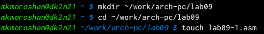
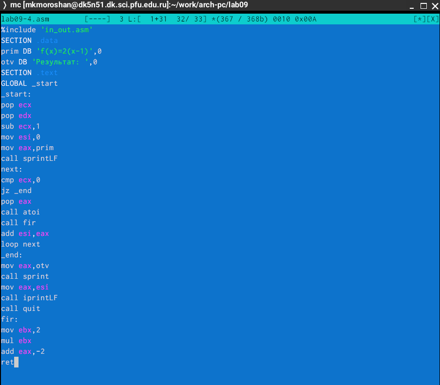

---
## Front matter
title: "Отчет по лабораторной работе №9"
subtitle: "Дисциплина: Архитектура компьютера"
author: "Морошан Матвей Корнелиович"

## Generic otions
lang: ru-RU
toc-title: "Содержание"

## Bibliography
bibliography: bib/cite.bib
csl: pandoc/csl/gost-r-7-0-5-2008-numeric.csl

## Pdf output format
toc: true # Table of contents
toc-depth: 2
lof: true # List of figures
fontsize: 12pt
linestretch: 1.5
papersize: a4
documentclass: scrreprt
## I18n polyglossia
polyglossia-lang:
  name: russian
  options:
	- spelling=modern
	- babelshorthands=true
polyglossia-otherlangs:
  name: english
## I18n babel
babel-lang: russian
babel-otherlangs: english
## Fonts
mainfont: IBM Plex Serif
romanfont: IBM Plex Serif
sansfont: IBM Plex Sans
monofont: IBM Plex Mono
mainfontoptions: Ligatures=Common,Ligatures=TeX,Scale=0.94
romanfontoptions: Ligatures=Common,Ligatures=TeX,Scale=0.94
sansfontoptions: Ligatures=Common,Ligatures=TeX,Scale=MatchLowercase,Scale=0.94
monofontoptions: Scale=MatchLowercase,Scale=0.94,FakeStretch=0.9
## Biblatex
biblatex: true
biblio-style: "gost-numeric"
biblatexoptions:
  - parentracker=true
  - backend=biber
  - hyperref=auto
  - language=auto
  - autolang=other*
  - citestyle=gost-numeric
## Pandoc-crossref LaTeX customization
figureTitle: "Рис."
listingTitle: "Листинг"
lofTitle: "Список иллюстраций"
lolTitle: "Листинги"
## Misc options
indent: true
header-includes:
  - \usepackage{indentfirst}
  - \usepackage{float} # keep figures where there are in the text
  - \floatplacement{figure}{H} # keep figures where there are in the text
---

# Цель работы

Целью данной лабораторной работы является приобретение навыков написания программ с использованием подпрограмм и знакомство с методами отладки при помощи GDB и его основными возможностями.

# Задание

	1. Реализация подпрограмм в NASM
	
	2. Отладка программам с помощью GDB
	
	3. Выполнение заданий для самостоятельной работы
	

# Выполнение лабораторной работы

## Реализация подпрограмм в NASM

Создаю каталог для выполнения лабораторной работы №9, перехожу в него и создаю файл (рис. [-@fig:001]).

{#fig:001 width=70%}

Копирую файл in_out.asm из загрузок в каталог для выполнения лабораторной работы №9 (рис. [-@fig:002])

{#fig:002 width=70%}

Ввожу текст программы из листинга 9.1 в файл lab09-1.asm  (рис. [-@fig:003])

{#fig:003 width=70%}

Создаю исполняемый файл и запускаю (рис. [-@fig:004])

{#fig:004 width=70%}

Изменяю текст программы для функции f(g(x)) (рис. [-@fig:005])

{#fig:005 width=70%}

Создаю исполняемый файл и запускаю его (рис. [-@fig:006])

{#fig:006 width=70%}

## Отладка программам с помощью GDB

Создаю файл lab09-2.asm с текстом программы из листинга 9.2 (рис. [-@fig:007])

{#fig:007 width=70%}

Текст программы lab09-2.asm (рис. [-@fig:008])

{#fig:008 width=70%}

Получаю исполняемый файл и провожу трансляцию с ключом -g, загружаю исполняемый файл в отладчик gdb. Также проверяю работу программы, запустив ее в оболочке GDB с помощью команды run (рис. [-@fig:009])

{#fig:009 width=70%}

Устанавливаю брейкпоинт на метку _start и запускаю (рис. [-@fig:010])

{#fig:010 width=70%}

Смотрю дисассимилированный код программы с помощью команды disassemble с метки _start (рис. [-@fig:011])

{#fig:011 width=70%}

Переключаюсь на отображение команд с Intel'овским синтаксисом, введя команду set disassembly-flavor intel (рис. [-@fig:012])

{#fig:012 width=70%}

Включаю режим псевдографики для более удобного анализа команды (рис. [-@fig:013])

{#fig:013 width=70%}

С помощью info breakpoints проверяю установку точек останова по имени метки на предыдущих шагах (рис. [-@fig:014])

{#fig:014 width=70%}

Устанавливаю точку останова и смотрю информацию о всех установленных точках останова (рис. [-@fig:015])

{#fig:015 width=70%}

Выполняю команду si (рис. [-@fig:016])

{#fig:016 width=70%}

Результат команды info registers (рис. [-@fig:017])

{#fig:017 width=70%}

Смотрю значение переменной msg1 (рис. [-@fig:018])

{#fig:018 width=70%}

Смотрю значение переменной msg2 и изменяю первый символ переменной msg1 (рис. [-@fig:019])

{#fig:019 width=70%}

Использую команду print (рис. [-@fig:020])

{#fig:020 width=70%}

Продолжаю и выхожу (рис. [-@fig:021])

{#fig:021 width=70%}

Копирую файл lab8-2.asm в файл с именем lab09-3.asm (рис. [-@fig:022])

{#fig:022 width=70%}

Создаю исполняемый файл, загружаю исполняемый файл в откладчик, указав аргументы. Устанавливаю точку останова перед первой инструкцией в программе и запускаю (рис. [-@fig:023])

{#fig:023 width=70%}

Элементы расположены с интервалом в 4 единицы т.к стек может хранить до 4 байт (рис. [-@fig:024])

{#fig:024 width=70%}

## Выполнение заданий для самостоятельной работы

Создаю файл lab09-4.asm для задания 1 (рис. [-@fig:025])

{#fig:025 width=70%}

Изменяю программу, реализовав вычисление значения функции f(x) как подпрограмму (рис. [-@fig:026])

{#fig:026 width=70%}

Создаю исполняемый файл и проверяю работу программы (рис. [-@fig:027])

{#fig:027 width=70%}

Создаю файл lab09-5.asm для задания 2 (рис. [-@fig:028])

{#fig:028 width=70%}

Ввожу текст программы из листинга 9.3 (рис. [-@fig:029])

{#fig:029 width=70%}

Создаю исполняемый файл и проверяю, что программа выдает ошибку (рис. [-@fig:030])

{#fig:030 width=70%}

Запускаю программу в отладчике (рис. [-@fig:031])

{#fig:031 width=70%}

Некоторые регистры стоят не на своих местах, поэтому исправляю это (рис. [-@fig:032])

{#fig:032 width=70%}

Запускаю еще раз программу и она выводит правильный ответ 25 (рис. [-@fig:033])

{#fig:033 width=70%}

# Выводы

При выполнении данной лабораторной работы я приобрел навыки написания программ с использованием подпрограмм и познакомился с методами отладки при помощи GDB и его основными возможностями.
