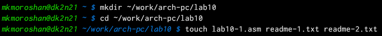
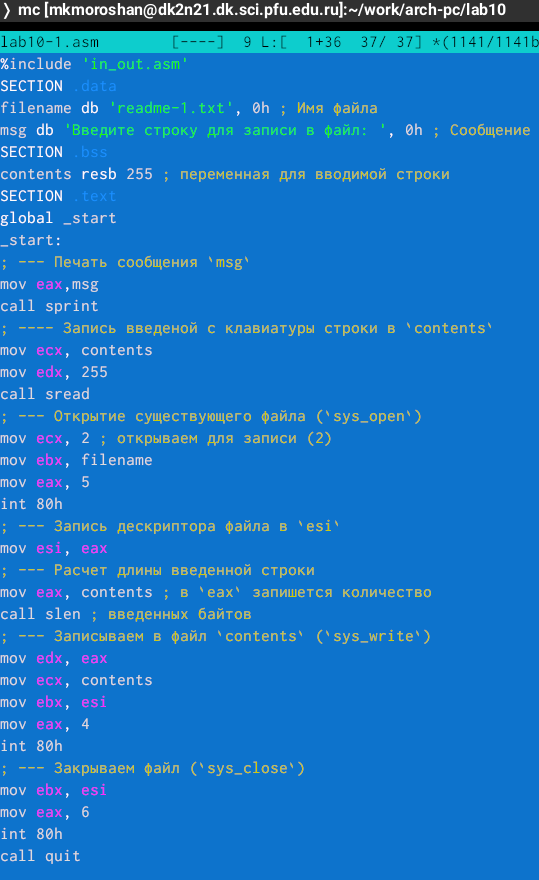
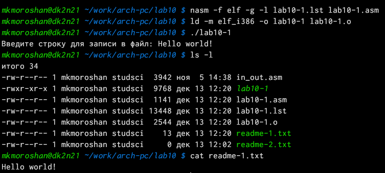
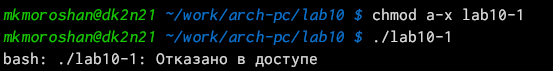
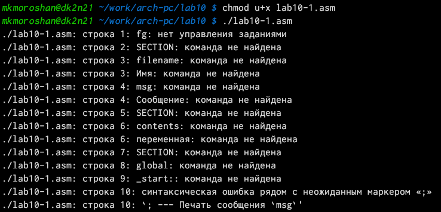
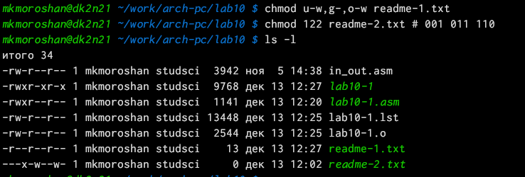
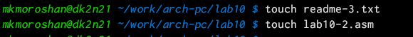
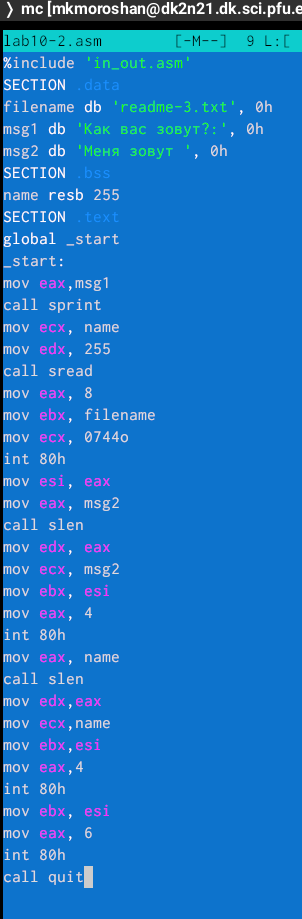
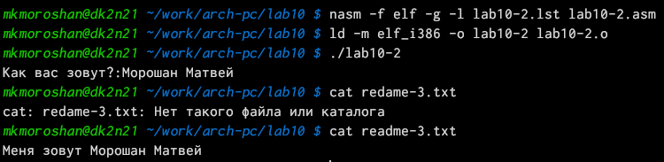

---
## Front matter
title: "Отчет по лабораторной работе №10"
subtitle: "Дисциплина: Архитектура компьютера"
author: "Морошан Матвей Корнелиович"

## Generic otions
lang: ru-RU
toc-title: "Содержание"

## Bibliography
bibliography: bib/cite.bib
csl: pandoc/csl/gost-r-7-0-5-2008-numeric.csl

## Pdf output format
toc: true # Table of contents
toc-depth: 2
lof: true # List of figures
fontsize: 12pt
linestretch: 1.5
papersize: a4
documentclass: scrreprt
## I18n polyglossia
polyglossia-lang:
  name: russian
  options:
	- spelling=modern
	- babelshorthands=true
polyglossia-otherlangs:
  name: english
## I18n babel
babel-lang: russian
babel-otherlangs: english
## Fonts
mainfont: IBM Plex Serif
romanfont: IBM Plex Serif
sansfont: IBM Plex Sans
monofont: IBM Plex Mono
mainfontoptions: Ligatures=Common,Ligatures=TeX,Scale=0.94
romanfontoptions: Ligatures=Common,Ligatures=TeX,Scale=0.94
sansfontoptions: Ligatures=Common,Ligatures=TeX,Scale=MatchLowercase,Scale=0.94
monofontoptions: Scale=MatchLowercase,Scale=0.94,FakeStretch=0.9
## Biblatex
biblatex: true
biblio-style: "gost-numeric"
biblatexoptions:
  - parentracker=true
  - backend=biber
  - hyperref=auto
  - language=auto
  - autolang=other*
  - citestyle=gost-numeric
## Pandoc-crossref LaTeX customization
figureTitle: "Рис."
listingTitle: "Листинг"
lofTitle: "Список иллюстраций"
lolTitle: "Листинги"
## Misc options
indent: true
header-includes:
  - \usepackage{indentfirst}
  - \usepackage{float} # keep figures where there are in the text
  - \floatplacement{figure}{H} # keep figures where there are in the text
---

# Цель работы

Целью данной лабораторной работы является приобретение навыков написания программ для работы с файлами

# Задание

	1. Выполнение заданий лабораторной работы
	
	2. Выполнение заданий для самостоятельной работы

# Выполнение лабораторной работы

## Выполнение заданий лабораторной работы

Создаю каталог для программ лабораторной работы №10, перехожу в него и создаю файлы lab10-1.asm, readme-1.txt, readme-2.txt (рис. [-@fig:001]).

{#fig:001 width=70%}

В файл lab10-1.asm ввожу код программы листинга 10.1 (рис. [-@fig:002]).

{#fig:002 width=70%}

Создаю исполняемый файл и проверяю его работу (рис. [-@fig:003]).

{#fig:003 width=70%}

С помощью команды chmod изменяю права доступа к исполняемому файлу lab10-1, запретив его выполнение (рис. [-@fig:004]).

{#fig:004 width=70%}

С помощью команды chmod добавляю права на исполнение файла (рис. [-@fig:005]).

{#fig:005 width=70%}

В соответствии с таблицей 10.4 предоставляю права доступа к файлу readme-1.txt в символьном виде, а readme-2.txt - в двоичном и проверяю командой ls -l (рис. [-@fig:006]).

{#fig:006 width=70%}

## Выполнение заданий для самостоятельной работы

Создаю 2 файла для самостоятельной работы (рис. [-@fig:007]).

{#fig:007 width=70%}

Пишу текст программы для выполнения самостоятельной работы в файл lab10-2.asm (рис. [-@fig:008]).

{#fig:008 width=70%}

Запускаю и проверяю на корректность программу (рис. [-@fig:009]).

{#fig:009 width=70%}

# Выводы

При выполнении данной лабораторной работы я приобрел навыки написания программ для работы с файлами
